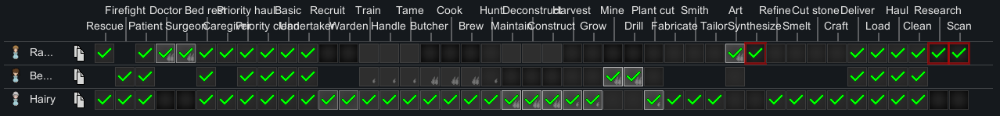
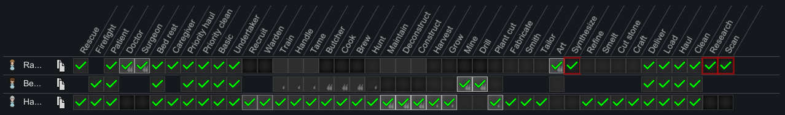

  
&emsp;
  
&emsp;
  
&emsp;
  

  
&emsp;
  

# Description

If you have a smaller screen or mods that add a lot of work types (like my own [Many Jobs](https://steamcommunity.com/sharedfiles/filedetails/?id=3013527266) for instance) you may have encountered the heartbreak of the unreadable Work tab.

This mod is very simple. It rotates the column labels by 90° to make a crowded Work tab more usable.

And as a bonus feature, **free gratis**, the mod enables scroll-wheel support for incrementing or decrementing work priorities. Just put your cursor over a priority box and scroll up or down. If manual priorities are disabled, scrolling will toggle the work type for the selected pawn. If manual priorities are on, scrolling up will raise the work type's priority, and scrolling down will lower it.

# Compatibility

This mod is compatible with [Priority Master](https://steamcommunity.com/sharedfiles/filedetails/?id=1994006442) and with [Grouped Pawns Lists](https://steamcommunity.com/sharedfiles/filedetails/?id=2340773428). It's _technically_ also compatible with [Fluffy's Work Tab](https://steamcommunity.com/sharedfiles/filedetails/?id=725219116) (from which this mod took inspiration), but if you run them both at the same time Fluffy's mod will override the functionality of this one, so I recommend you don't do that.

# Acknowledgments

Thanks to [Fluffy](https://steamcommunity.com/id/FluffyMods/myworkshopfiles/?appid=294100) whose Work Tab mod inspired this one, and special thanks to [Krypt](https://steamcommunity.com/profiles/76561198052696897/myworkshopfiles/?appid=294100) who taught me a workaround for an annoying text-rotation bug.

Portions of the materials used to create this mod are trademarks and/or copyrighted works of Ludeon Studios Inc. All rights reserved by Ludeon. This content/mod is not official and is not endorsed by Ludeon.
